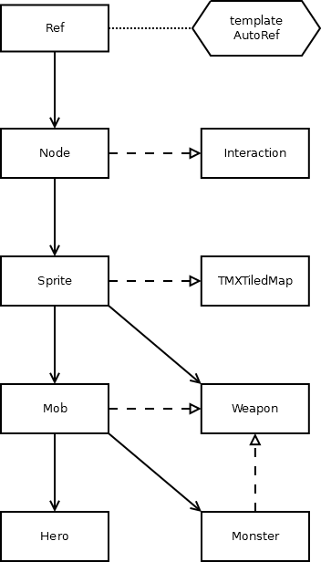

# Fate-grand-rider

2020软工大项目fate-grand-rider说明文档

## 类的框架


本项目中主要的（基）类的结构如图，主要包括继承自cocos2d中的动画精灵`Sprite`的生物`Mob`和武器`Weapon`，以及继承自cocos2d中的组件`Component`的互动组件`Interaction`。

主要类的说明如下：
* `Mob`：生物，提供关于生物移动时对应物理引擎的接口，并作为`Hero`和`Monster`类的基类。
* `Weapon`：武器，所有的生物的攻击都通过武器来完成，武器提供的接口为攻击和瞄准。
* `Hero`：英雄，即主角，由玩家键盘控制移动，携带的武器可以用鼠标控制进行攻击。
* `Monster`：怪物，行为与英雄类似，但由电脑AI控制。

互动组件`Interaction`比较特殊，所有元素（英雄、怪物、地图）中的互动都以`Interaction`为中介进行，即首先用`getInteraction`获取节点对应的互动，然后再调用互动对应的函数，一个典型的例子如下：
```c++
auto space = GameScene::getRunningScene()->getSpace();
if (auto target = space->queryPointNearest(this->getPosition()))
  getInteraction(target)->attack(this, _damage);
```
例中展现武器类进行攻击的基本模式，首先获取了物理空间以进行搜索最近的目标，若找到目标（指针非零），则获取对应的互动组件，调用该组建的`attack`方法，完成一次攻击。
`Interaction`类所进行的互动包括，角色与地图的互动：靠近`touch`、离开`endTouch`、空格键进行对话`dialog`；地图中建筑与房间的互动：进入房间`enterRoom`、离开房间`enterRoom`，连接房间`linkRoom`；从地图中加载互动的静态方法`load`；受攻击时的互动`attack`。这些具体的互动的方法不会全部定义，如果不定义时默认忽略对应类型的互动。
